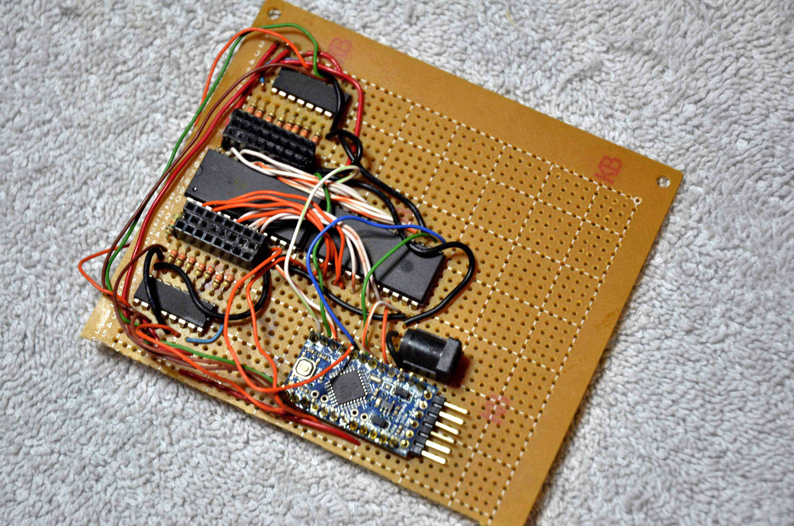
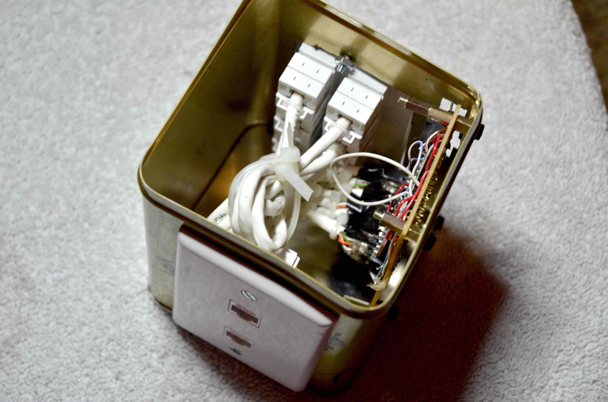

# Electronics projects #

## 16-port plant monitor ##

This project was created when my spouse found that the moisture sensors
she bought, to let her know when a plant needed water, was purchased by a new
company, and went from consuming the battery in six months, to consuming
the battery in a week.  She had about 60 total moisture sensors, so changing 
batteries at that pace wasn't practical.  I pulled the moisture sensors apart,
and used ethernet wire to connect them to an Arduino, in order to make it 
possible to provide external power.  There are a lot of plants to look at,
so I ended up using a couple of 16-port multiplexers, to allow me to address up 
to 16 sensors from a single Arduino, as well as two 8-bit shift registers, 
to allow me to light an LED on each of the Moisture Sensor sticks.

Here it is, mounted on perfboard:

Here it is, assembled:

