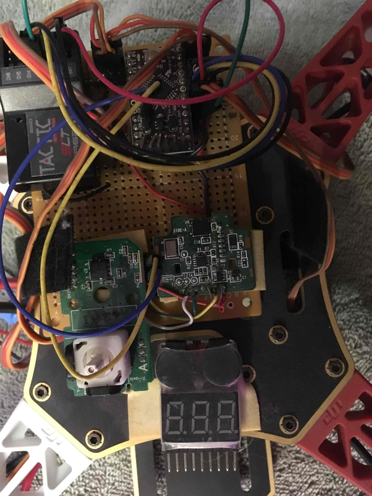

# Electronics projects #

## Contents ##

* [plant monitor](#port-plant-monitor)
* [snake enclosure monitor](#snake-enclosure-monitor)
* [adjustable height desk](#adjustable-height-desk)
* [WiiMotion Quad Copter](#wii-motion-quad-copter)

## 16-port plant monitor ##

This project was created when my spouse found that the moisture sensors
she bought.  Unfortunately, they conumed their batteries in just a week.  She 
had about 60 total moisture sensors, so changing batteries at that pace wasn't 
practical.  I pulled the moisture sensors apart, and used ethernet wire to 
connect them to an Arduino, in order to make it possible to provide external 
power.  There are a lot of plants to look at, so I ended up using a couple of 
16-port multiplexers, to allow me to address up to 16 sensors from a single 
Arduino, as well as two 8-bit shift registers, to allow me to light an LED on 
each of the moisture sensor sticks.

[Here's the github repository](https://github.com/tnordloh/arduino_16_port_plant_reader)
and a couple of photos.

Here it is, mounted on perfboard:

Here it is, assembled:

## Snake enclosure monitor ##

This project was created, to ensure that we remembered to feed snakes, once
per week, and to make sure that, whoever fed them could signal to the rest of 
us, that they had been fed.  It has six leds, and lights one up each day.  On 
the seventh day, the six leds start blinking.  Additionally, there is a simple
moisture sensor, that runs into the water bowl, which will blink separately, 
when the water bowl is dry.

[Here's the github repository](https://github.com/tnordloh/home_automation)
and a couple of photos.

The Perfboard:

Assembled:

## adjustable-height desk ##
This project originated with a desire to provide more variety in seating positions.
I get back pain, and being able to change how I sit seems to help a lot.  
I used some metal struts from Lowes, and a couple of 
[linear](https://www.amazon.com/WindyNation-Stroke-Linear-Actuator-Maximum/dp/B00Y1QD9AM)
[actuators](https://www.amazon.com/Inch-Linear-Actuator-Volt-Pounds/dp/B007SJAHW2).

That, in combination with
[relay kits](https://www.amazon.com/MPC-0462-Linear-Actuators-Wiring/dp/B00LON21DQ)
and a 
[wireless controller](https://www.amazon.com/gp/product/B01CCSG2ZY)
completed the project.  This is one the simplest projects I've built, and one of 
the most expensive, but my desk is pretty comfortable.
The desk in 'sit on the floor' mode:

The desk in 'sit in the chair' mode: 

## wii-motion quad copter ##

My son and I built this quad copter; the controller is an 
[arduino pro mini](https://www.sparkfun.com/products/11113); you can learn more
about it 
[here](http://www.multiwii.com/wiki/index.php?title=Main_Page).

The MutiWii is built from the gyroscope built into the Wii Motion Plus, 
and the accelerometer built into the Wii Nunchuck.  It was a fun little project,
and was actually my first introduction to Arduino.
Here's what the final controller looks like.  You can still see the joystick
from the nunchuck :)

Here's a second picture, with my hand, for scale.

## flashing MSI 370X Pro Gaming motherboard BIOS ##

A few days ago, a friend asked me to troubleshoot a motherboard that was locking
up.  I attempted to update the BIOS, and of course, it locked up, effectively
bricking the motherboard.  A little research, and I found that it was possible
to flash the BIOS with the use of a Raspberry PI.  I used these links
as a reference:

[rPI hookup](https://forum-en.msi.com/index.php?topic=283908.msg1608415#msg1608415)
[diagrams and such](https://forum-en.msi.com/index.php?topic=285607.0)

The confusing part for me was, I never got to really see the wiring diagram.
Also, the Raspberry PI required a couple of tweaks to get it to talk to the 
BIOS chip; since that's not commonly used, the interface isn't enabled by 
default.  So, here are a couple of pics, and such, to clarify the things that
I got stuck on:

For the Raspberry Pi, I was missing the /dev/spidev0.0 files.  Here are the 
steps I had to take, to make them appear:
1.  sudo apt-get update
2.  sudo apt-get upgrade
3.  edit the /config.txt file; I had to uncomment the line containing "dtparam=spi=on", and reboot, which made the spidev files appear.

Wiring everything up.  This part was confusing, because I didn't know how to 
map the MISO and MOSI ports -- which one goes to "SO/SI01", and which one 
goes to "SI/SO0".  I eventually found [this link](https://www.raspberrypi.org/forums/viewtopic.php?f=63&t=136912) that labeled all of the ports; here's a pic, with what I ended up with; an external power supply, set to 1.5 volts, the chip clip seen in some of the other links, and the flashrom tool.

Here's a pic of what that looks like

and a wiring diagram, to really spell it out:

after that the instructions at the link below worked fine: 
[rPI basic instructions](http://www.win-raid.com/t58f16-Guide-Recover-from-failed-BIOS-flash-using-Raspberry-PI.html)

